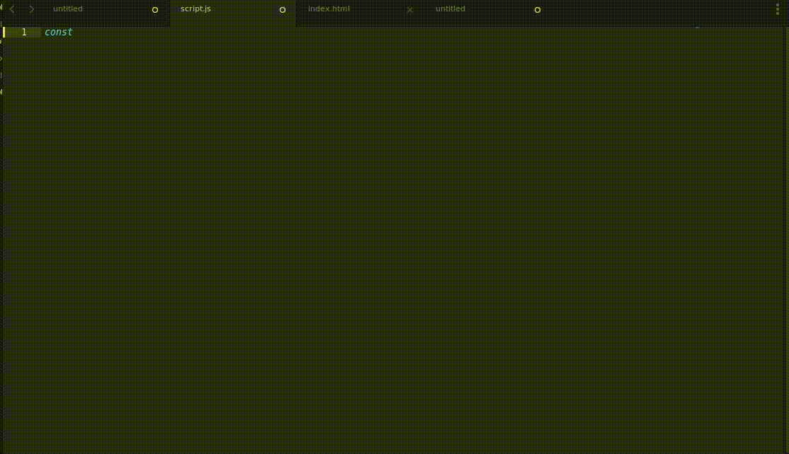

# 🥞 Algo-Crêpes


Un projet pédagogique pour expliquer la programmation aux non-développeurs à travers une recette de crêpes.

## 📖 Principes

A partir d'une [recette de pâte à crêpes](./docs/Contexte.pdf), création d'un [fichier Javascript basique](./src/algo-crepes-original.js) avec [enregistrement vidéo](./docs/demo.mp4) en accéléré pour visualiser en quoi consiste le développement.



**100% JavaScript** - Aucun PHP, juste du JS pur et une interface HTML pour la démo !

## 🎯 Philosophie du Projet

- ✅ **Code JavaScript pur** dans `/src`
- ✅ **Démo web interactive** dans `/demo` 
- ✅ **Aucune dépendance** - pas de npm, pas de build
- ✅ **Compatible LAMP** - uploadez et ça marche
- ✅ **Structure professionnelle** - code organisé et testé

## 📂 Structure du Repository

```
algo-crepes/
├── src/                        # Code source JavaScript
│   ├── algo-crepes-original.js    # Votre code initial
│   └── algo-crepes.js             # Version améliorée (classe)
│
├── demo/                       # Interface de démo
│   └── index.html                 # Page HTML de démonstration
│
├── assets/                     # Ressources statiques
│   ├── css/
│   │   └── styles.css             # Styles de l'interface
│   └── js/
│       └── demo.js                # Logique de l'interface
│
├── data/                       # Données (traductions, config)
│   └── translations/
│       ├── fr.json                # Traductions françaises
│       └── en.json                # Traductions anglaises
│
├── docs/                       # Documentation
│   ├── Contexte.pdf            # Spécifications originales
│   ├── demo.mp4                  # Vidéo de codage
│   └── CONCEPTS.md               # Concepts pédagogiques
│
├── README.md                   # Ce fichier
├── LICENSE                     # Licence
└── .gitignore                  # Fichiers à ignorer
```

## 🚀 Installation & Utilisation

### Serveur LAMP

**Sur votre serveur Apache :**
```bash
# Copier le dossier dans votre DocumentRoot
cp -r algo-crepes /var/www/html/

# Accéder à la démo
http://votre-domaine.com/algo-crepes/demo/
```

**C'est tout !** Pas de configuration, pas de commande, ça marche directement.

## 💻 Utiliser le code JavaScript

### Dans une page HTML

```html
<!DOCTYPE html>
<html>
<head>
    <title>Ma Recette</title>
</head>
<body>
    <script src="src/algo-crepes.js"></script>
    <script>
        // Créer une instance
        const recipe = new CrepesRecipe('fr');
        
        // Charger les traductions
        recipe.loadTranslations('fr').then(() => {
            // Modifier des ingrédients
            recipe.setIngredient('oeuf', 4);
            
            // Faire les crêpes
            const success = recipe.makeCrepes();
            
            // Afficher les logs
            console.log(recipe.getLogs());
        });
    </script>
</body>
</html>
```

### En Node.js (optionnel)

Le code fonctionne aussi en Node.js si vous le souhaitez :

```javascript
// Adapter pour Node.js
const fs = require('fs');

class CrepesRecipe {
    // ... le code existant ...
    
    async loadTranslations(lang) {
        const content = fs.readFileSync(`data/translations/${lang}.json`, 'utf8');
        this.translations = JSON.parse(content);
    }
}

const recipe = new CrepesRecipe('fr');
await recipe.loadTranslations('fr');
recipe.makeCrepes();
```

## 🎓 Concepts pédagogiques illustrés

### 1. Variables et Types
```javascript
const ingredients = {
    'farine': 375,  // Nombre
    'sel': 2,       // Nombre
    'required': true // Booléen
};
```

### 2. Conditions (if/else)
```javascript
if (status === 'perfect') {
    log('Parfait !');
} else if (required) {
    return false; // Arrêter
}
```

### 3. Boucles (for...of)
```javascript
for (const ingredient of this.order) {
    checkIngredient(ingredient);
}
```

### 4. Fonctions et Méthodes
```javascript
makeCrepes() {
    // Logique de la recette
}
```

### 5. Classes et POO
```javascript
class CrepesRecipe {
    constructor(lang) { }
    makeCrepes() { }
}
```

### 6. Programmation asynchrone
```javascript
async loadTranslations(lang) {
    const response = await fetch(`data/translations/${lang}.json`);
    this.translations = await response.json();
}
```

## 🌍 Support multilingue

Le projet supporte :
- 🇫🇷 Français
- 🇬🇧 Anglais

### Ajouter une langue

1. Créer `data/translations/es.json`
2. Copier la structure de `fr.json`
3. Traduire tous les textes
4. Utiliser : `recipe.loadTranslations('es')`

## 📝 API JavaScript

### Classe `CrepesRecipe`

#### Constructeur
```javascript
new CrepesRecipe(lang = 'fr')
```

#### Méthodes principales
```javascript
// Charger les traductions
await recipe.loadTranslations('fr')

// Modifier un ingrédient
recipe.setIngredient('oeuf', 4)

// Vérifier un ingrédient
recipe.checkIngredient('oeuf') // 'perfect' | 'insufficient' | 'excess'

// Faire les crêpes
const success = recipe.makeCrepes() // true | false

// Obtenir les logs
const logs = recipe.getLogs() // Array<string>

// Réinitialiser
recipe.reset()

// Obtenir le statut complet
const status = recipe.getStatus()
```

## 🔧 Personnalisation

### Modifier les quantités par défaut

Éditer `src/algo-crepes.js` :

```javascript
this.recipe = {
    'farine': { 
        required: true, 
        amount: 375,  // ← Changer ici
        unit: 'gramme' 
    }
    // ...
}
```

### Changer les couleurs

Éditer `assets/css/styles.css` :

```css
:root {
    --color-primary: #ff6b6b; /* ← Votre couleur */
}
```

## 🤝 Contribution

Les contributions sont bienvenues ! 

1. Fork le projet
2. Créer une branche (`git checkout -b feature/AmazingFeature`)
3. Commit (`git commit -m 'Add AmazingFeature'`)
4. Push (`git push origin feature/AmazingFeature`)
5. Ouvrir une Pull Request

## 📄 Licence

Creative Commons BY NC SA - voir [LICENSE.md](LICENSE.md)

## 🩼 AI

Utilisation de [ClaudeAI](https://claude.ai/) pour la génération du fichier `index.html` de démo

## 🆘 Support

- 📖 Consulter la documentation dans `/docs`
- 🐛 [Signaler un bug](https://github.com/GreenEffect/algo-crepes/issues)

## 🙏 Remerciements

Projet créé dans un but pédagogique pour rendre la programmation accessible.

---

**Bon appétit de code ! 🥞💻**

*Version 2.0 - 100% JavaScript*
